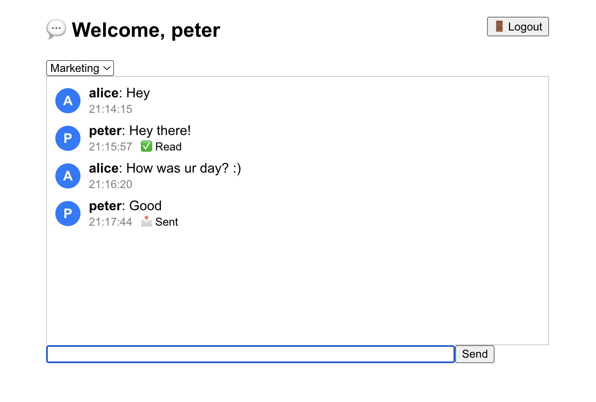

# 💬 Real-Time Chat App

Welcome to the **Real-Time Chat App** — a full-stack messaging platform built with **Socket.IO**, **React**, **Node.js**, and **MongoDB**.

### 🚀 Features

- 🔐 **JWT Authentication** — Secure login and token-based user sessions.
- 💬 **Multi-Room Chat** — Join different chat rooms like `general`, `tech`, or `marketing`.
- 📜 **Chat History** — Loads the last 50 messages in each room from MongoDB.
- ✍️ **Typing Indicator** — See when another user is typing in real-time.
- ✅ **Read Receipts** — Know if your messages have been read by others.
- 📡 **Real-Time Messaging** — All updates happen instantly via WebSockets.
- 🔁 **Auto-Scroll & Auto-Focus** — Seamless user experience with smooth scrolling and input focus.
  
---

### 🛠️ Stack

| Frontend       | Backend        | Database    | Real-Time       |
|----------------|----------------|-------------|-----------------|
| React.js       | Node.js + Express | MongoDB     | Socket.IO       |

---

### 📁 Project Structure

```bash
📦 root/
├── backend/
│   ├── models/
│   │   ├── User.js
│   │   └── Message.js
│   ├── index.js
│   └── .env
├── frontend/
│   └── App.js
└── README.md
```

---

### ⚙️ Setup Instructions

1. **Clone the Repo**  
   ```bash
   git clone https://github.com/CastleSilver/messaging-app.git
   cd messaging-app
   ```

2. **Backend Setup**
   ```bash
   cd backend
   npm install
   touch .env
   ```

   Fill in your `.env` with:
   ```
   MONGO_URI=your_mongo_connection_string
   JWT_SECRET=your_jwt_secret
   ```

   Then:
   ```bash
   node index.js
   ```

3. **Frontend Setup**
   ```bash
   cd frontend
   npm install
   npm start
   ```

4. Open your browser at `http://localhost:3000`

---

### 📸 Screenshots

| Login         | Chat Room      | 
|---------------|----------------|
|  |  |

---

### 🧠 Future Plans

- 🧵 Private Direct Messages (DMs)
- 🖼️ Media Upload Support (images, files)
- 🧑‍🤝‍🧑 User Presence / Online Status
- 📱 Responsive Mobile UI
- 🧪 Unit and Integration Tests

---

### 👨‍💻 Author

Built by Seongeun Heo — inspired by the power of real-time apps and the joy of chatting ✨

---

### 🧾 License

This project is licensed under the MIT License.

```

---

Let me know if you'd like this exported into a file or if you'd like the sections tailored differently (e.g. added deployment steps, Heroku/Vercel setup, etc.).

